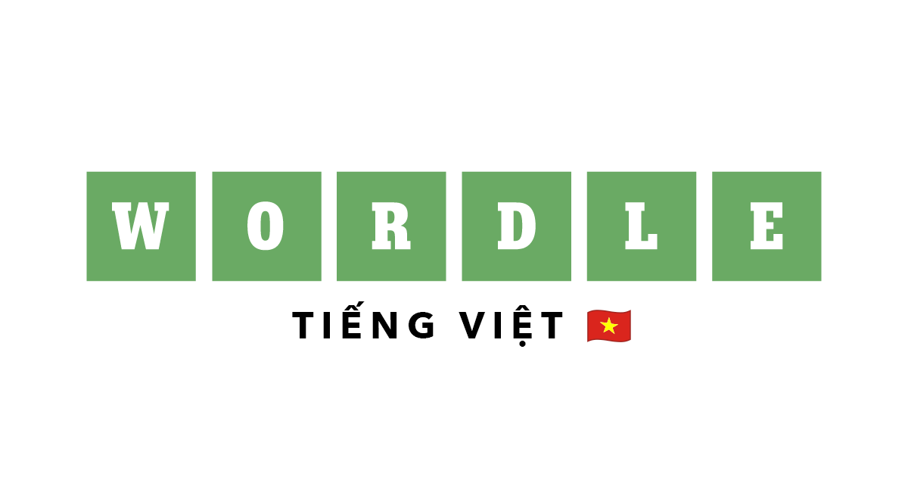

**Wordle Tiếng Việt** là trò chơi đoán từ dựa trên cảm hứng từ Wordle, dành riêng cho người dùng tiếng Việt. Bạn có 6 lượt để đoán một từ tiếng Việt gồm 7 chữ cái (không dấu, không khoảng trắng). Sau mỗi lần đoán, các ô chữ sẽ đổi màu để gợi ý mức độ chính xác:

- 🟩 **Xanh lá**: Chữ đúng vị trí.  
- 🟨 **Vàng**: Chữ đúng nhưng sai vị trí.  
- ⬜ **Xám**: Chữ không có trong từ.

## Tính năng mới
- **Bộ từ chuẩn**: Nhiều từ tiếng Việt đang được cập nhật và chuẩn hoá.  
- **Hiệu ứng Confetti**: Thêm hiệu ứng mưa giấy khi chiến thắng.  
- **Motion Animations**: Giao diện sử dụng Framer Motion để tăng trải nghiệm tương tác.

## Cách chơi
1. Nhập một từ tiếng Việt hợp lệ (7 chữ cái, không dấu, không khoảng trắng).  
2. Nhấn **Enter** để xác nhận.  
3. Quan sát màu sắc ô chữ để suy luận.  
4. Có tối đa 6 lượt đoán và có thể dùng tối đa 3 gợi ý.  
5. Nếu đoán đúng hoặc hết lượt, đáp án sẽ hiển thị kèm giải nghĩa.

## Cách chương trình hoạt động
- **Chọn từ ngẫu nhiên**: Lấy từ trong danh sách cục bộ [`lib/wordle_valid.js`](lib/wordle_valid.js).  
- **So sánh & đánh giá**: Hàm nội bộ kiểm tra từng chữ cái, trả về `correct`, `present` hoặc `absent`.  
- **Gợi ý**: Nhấn nút "Gợi ý" để biết một chữ cái có trong từ (tối đa 3 lần).  
- **Giải nghĩa**: Sau khi thắng/thua, hiển thị nghĩa và ví dụ (nếu có).  
- **Hiệu ứng**: Dùng [Canvas-Confetti](https://www.npmjs.com/package/canvas-confetti) và [Framer Motion](https://www.framer.com/motion/) để tăng trải nghiệm.  

## Cài đặt & chạy ứng dụng
### Yêu cầu
- Node.js >= 18
- pnpm (hoặc npm/yarn/bun)

### Cài đặt
```bash
git clone https://github.com/minhqnd/wordle-vietnamese.git
cd wordle-vietnamese
pnpm install
```

### Chạy ứng dụng
```bash
pnpm dev
```
Mở [http://localhost:3000](http://localhost:3000) trên trình duyệt để bắt đầu chơi.

